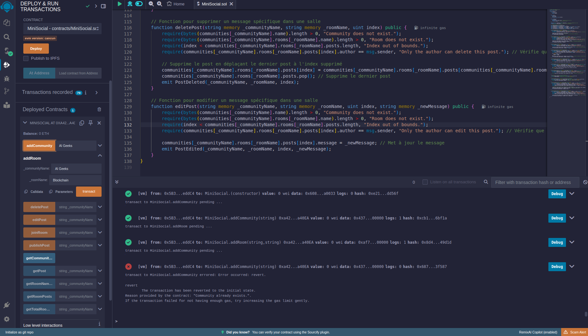
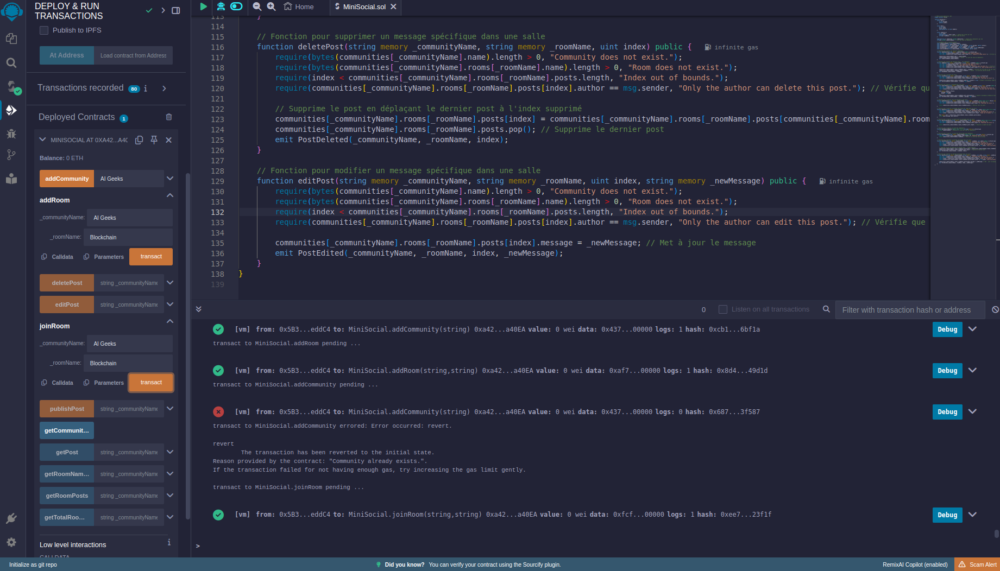
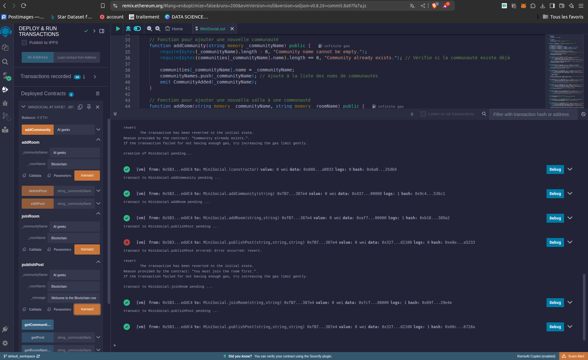
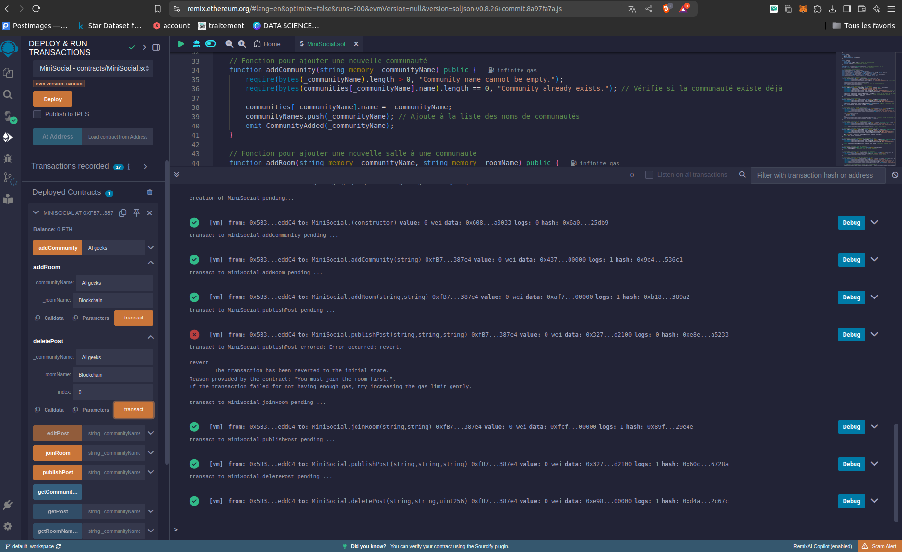
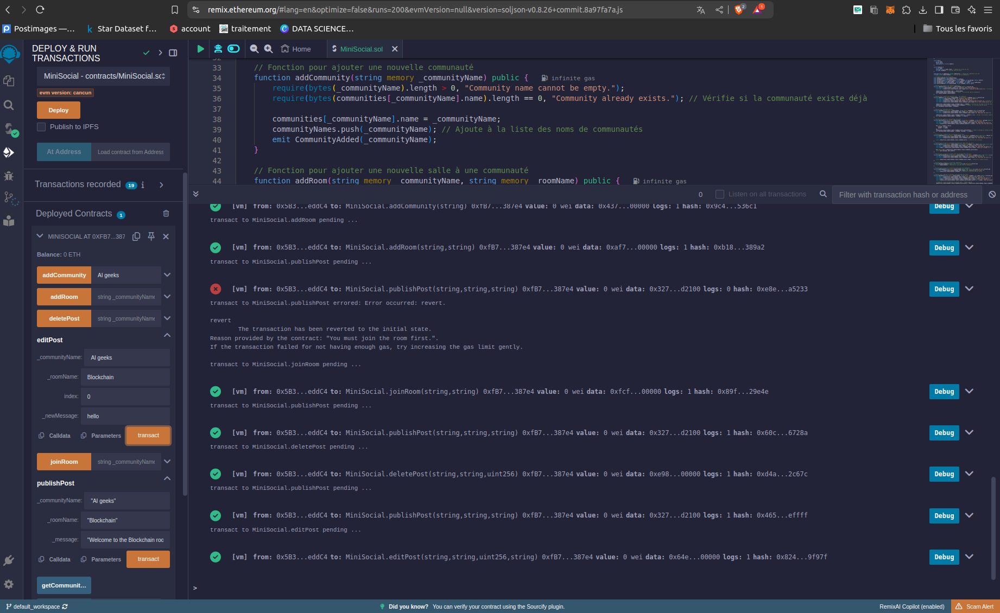
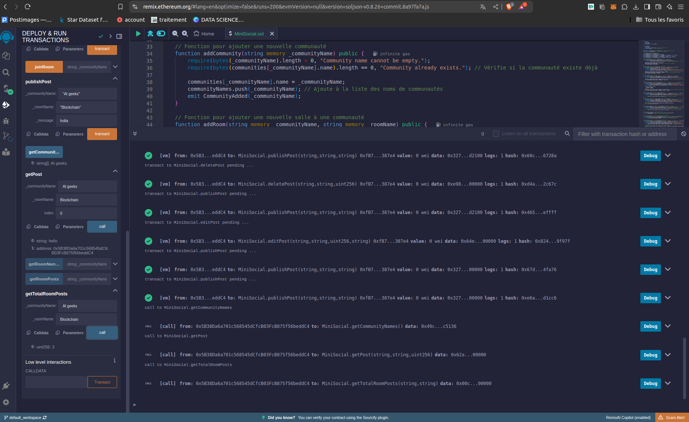

# simple-social-network-

Ce projet consiste en la création d'un mini réseau social décentralisé en utilisant des smart contracts écrits en Solidity.une langue de programmation utilisée pour écrire des contrats intelligents sur la blockchain Ethereum. Le réseau social permet de créer et gérer des communautés et des salles, ainsi que de publier, récupérer, supprimer et modifier des messages. Le contrat a été déployé et testé sur le réseau de test SepoliaETH en utilisant Remix IDE et MetaMask.

## Fonctionnalités

- **Création de communautés** : Ajout de nouvelles communautés.
- **Ajout de salles** : Ajout de salles à des communautés existantes.
- **Rejoindre des salles** : Permet aux utilisateurs de rejoindre des salles spécifiques.
- **Publication de messages** : Les utilisateurs peuvent publier des messages dans les salles.
- **Suppression de messages** : Les messages peuvent être supprimés par leurs auteurs.
- **Modification de messages** : Les messages peuvent être modifiés après leur publication.
- **Récupération et comptage des messages** : Les messages peuvent être récupérés et comptés pour une salle donnée.

## Déploiement et Tests

Le contrat a été déployé sur le réseau de test SepoliaETH en utilisant Remix IDE et MetaMask. Les étapes de test suivantes ont été réalisées :

1. **Ajout de Communautés et de Salles** :
   - Création d’une communauté : `addCommunity("AI Geeks")`
   - Ajout de salles à la communauté : `addRoom("AI Geeks", "Blockchain")` et `addRoom("AI Geeks", "AI Innovations")`
   - Vérification de la duplication des communautés : une tentative d’ajout d’une communauté avec un nom déjà existant retourne une erreur.
   

2. **Rejoindre des Salles** :
   - Utilisateurs rejoignant les salles : `joinRoom("AI Geeks", "Blockchain")`
   

3. **Publication de Messages** :
   - Publication de messages : `publishPost("AI Geeks", "Blockchain", "Welcome to the Blockchain room!")`
   

4. **Suppression de Messages** :
   - Suppression d’un message : `deletePost("AI Geeks", "Blockchain", 0)`
   

5. **Modification de Messages** :
   - Modification d’un message : `editPost("AI Geeks", "Blockchain", 0, "Updated message.")`
   

6. **Récupération et Comptage des Messages** :
   - Récupération de messages : `getRoomPosts("AI Geeks", "Blockchain")`
   - Récupération d’un message spécifique : `getPost("AI Geeks", "Blockchain", 0)`
   - Comptage des messages : `getTotalRoomPosts("AI Geeks", "Blockchain")`
   

## Conclusion

Ce projet a permis de mettre en œuvre un mini réseau social décentralisé en utilisant des smart contracts en Solidity. Les principales fonctionnalités incluent la création et la gestion des communautés et des salles, ainsi que la publication, la récupération, la suppression et la modification de messages. Le déploiement et les tests sur le réseau de test SepoliaETH ont été concluants.

## Prérequis

- Remix IDE
- MetaMask
- Compte sur SepoliaETH

## Installation

1. Cloner le dépôt : `git clone https://github.com/ARICHI-FZ/simple-social-network-.git`
2. Ouvrir le projet dans Remix IDE.
3. Déployer le contrat sur le réseau de test SepoliaETH.

## Utilisation

1. Utiliser MetaMask pour se connecter au réseau SepoliaETH.
2. Déployer le contrat depuis Remix IDE.
3. Utiliser les fonctions disponibles pour interagir avec le contrat (ajout de communautés, salles, publication de messages, etc.).

## Auteurs

- Fatima Zahra Arichi

## Licence

Ce projet est sous licence MIT. Voir le fichier [LICENSE](LICENSE) pour plus de détails.
